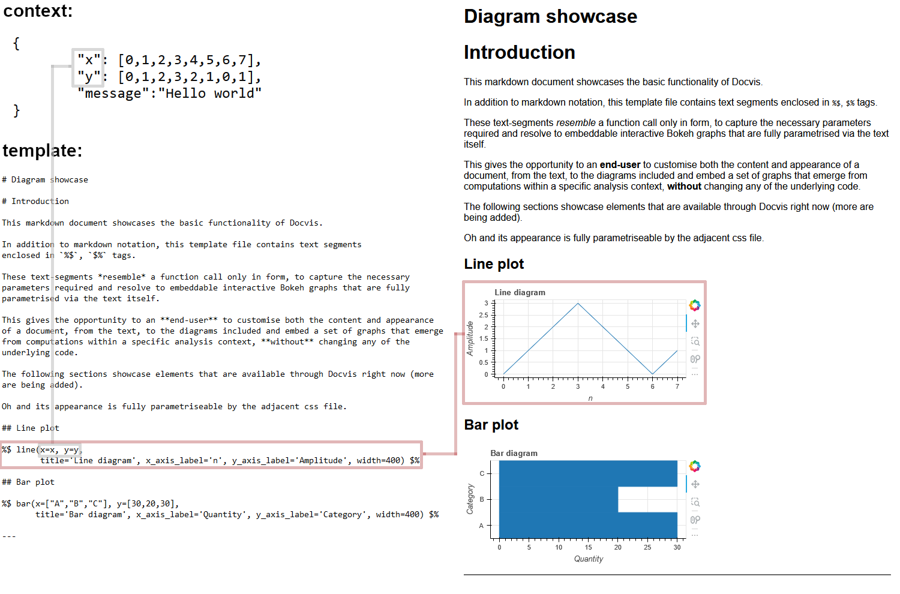

DocVis
======

A package to create dynamic stand-alone documents with complex data visualisations,
right from the markup.

Use it to give your **end-users** the ability to compile their own standalone HTML 
files, complete with interactive plots that they can configure entirely from the 
markup.

Plots can be entered along with markdown with the following:

``%$ line(x=[0,1,2,3], y=[0,1,0,1], title="Some plot") $%``

or

``%$ line(x=x_data, y=y_data, title="Some plot") $%``

Assuming that variables ``x_data, y_data`` have been passed into the context.

Plot paramaters that can be changed include the data to be plotted, Plot Title, 
X label, Y label and others.

DocVis includes a command line script that showcases its capabilities.

For a summary of its output:

